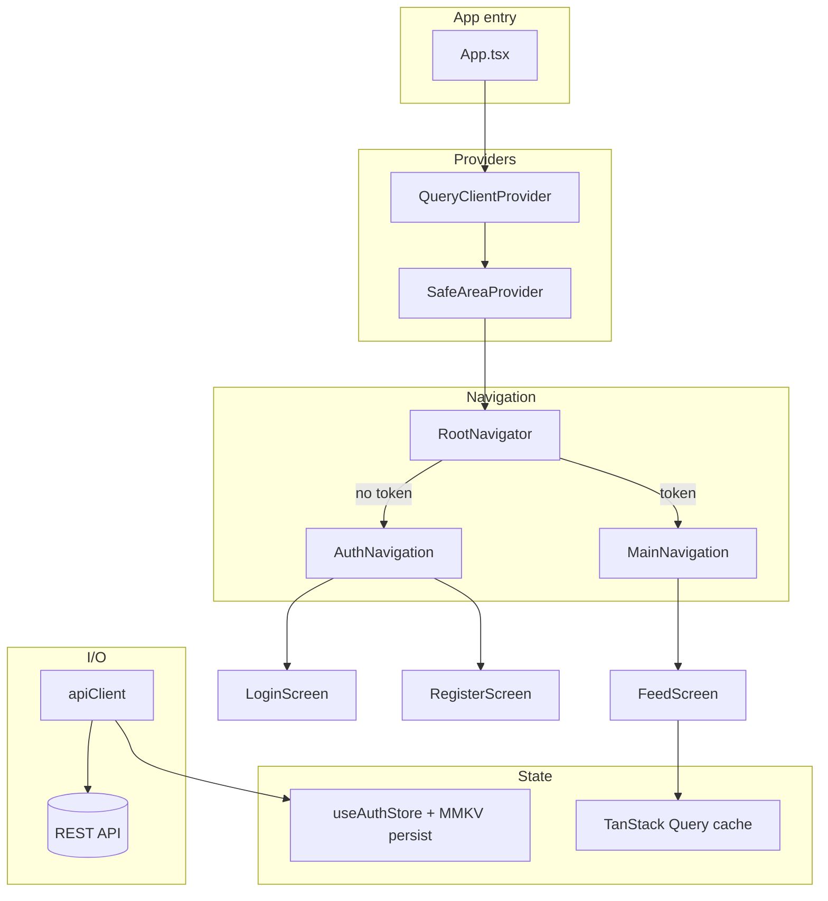

# Architecture

**Pattern:** Single React Native client (Expo); monolithic app binary with **feature-oriented** source layout and **layered** cross-cutting services (`services`, `store`, `theme`).

## High-Level Structure

## Identified Patterns

### Static stack navigators (React Navigation 7)

**Location:** `src/navigation/AuthNavigator.tsx`, `MainNavigator.tsx`  
**Purpose:** Type-safe stacks without a separate navigation ref container pattern for these flows.  
**Implementation:** `createNativeStackNavigator({ screens: { ... } })` then `createStaticNavigation(stack)`.

### Auth-gated root

**Location:** `src/navigation/RootNavigator.tsx`  
**Purpose:** Single boolean split between authenticated and unauthenticated UX.  
**Implementation:** `useAuthStore((s) => s.token)` → render `MainNavigation` or `AuthNavigation`.

### Central HTTP client with interceptors

**Location:** `src/services/api/client.ts`  
**Purpose:** Attach `Authorization: Bearer <token>` from Zustand; global 401 handling.  
**Implementation:** Axios instance + `useAuthStore.getState()` inside interceptors (store read, not React hooks).

### Persisted auth slice

**Location:** `src/store/authStore.ts`, `src/store/mmkvStorage.ts`  
**Purpose:** Survive app restarts with fast key-value storage; graceful fallback to in-memory `Map` if MMKV fails.  
**Implementation:** Zustand `persist` + `createJSONStorage(() => mmkvStorage)`; `partialize` keeps only `token`.

### Feature modules

**Location:** `src/features/auth`, `src/features/feed`  
**Purpose:** Colocate screens, hooks, services, and types per domain.  
**Implementation:** e.g. `feed/services/feedApi.ts` + `feed/hooks/useFeedItems.ts` + `feed/types`.

### Shared design tokens

**Location:** `src/theme/*`  
**Purpose:** Consistent spacing, color, typography across screens.  
**Implementation:** Exported `const` objects consumed by `StyleSheet.create` in screens.

## Data Flow

### Authentication (current behavior)

1. User submits login → `LoginScreen` calls `setToken('demo-token')` (stub).
2. `RootNavigator` sees token → mounts `MainNavigation`.
3. Subsequent HTTP requests: `apiClient` request interceptor reads `useAuthStore.getState().token` and sets header.
4. On 401 response: interceptor calls `signOut()` → token cleared → user returns to auth stack.

### Feed (prepared, not fully wired)

1. `useFeedItems` defines a query with key `['feed','items']` and `queryFn: fetchFeedItems`.
2. **Query is disabled** (`enabled: false` in `useFeedItems.ts`).
3. `FeedScreen` does not call `useFeedItems`; it renders `FlashList` with an empty placeholder array and copy pointing to future API wiring.

## Code Organization

**Approach:** Hybrid — **features** (`src/features/*`) for product areas, **shared infrastructure** at `src/navigation`, `src/services`, `src/store`, `src/theme`, `src/constants`, `src/shared`.

**Structure (conceptual):**

- `src/features/<domain>/screens` — route-level UI
- `src/features/<domain>/hooks` — React Query or domain hooks
- `src/features/<domain>/services` — API functions
- `src/features/<domain>/types` — TypeScript types

**Module boundaries:** Path aliases (`@features`, `@services`, …) mirror physical folders; Babel and `tsconfig` stay aligned.
