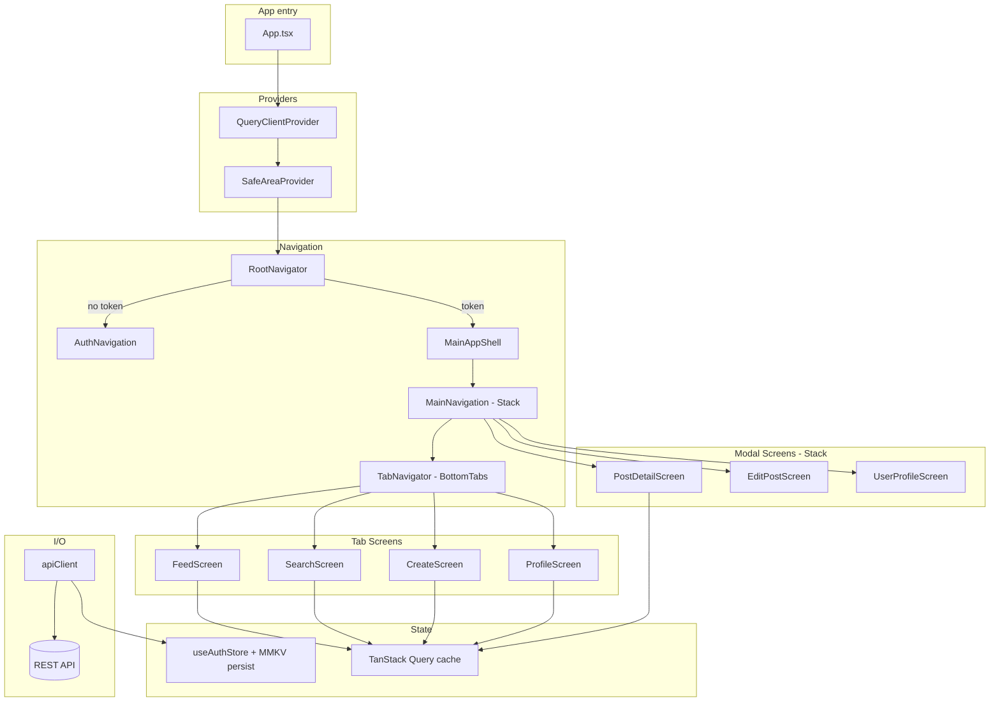

# Architecture

**Pattern:** Single React Native client (Expo); monolithic app binary com layout de fontes **orientado a features** e serviços transversais compartilhados (`services`, `store`, `theme`).

## High-Level Structure

## Identified Patterns

### Static stack navigators (React Navigation 7)

**Location:** `src/navigation/AuthNavigator.tsx`, `MainNavigator.tsx`  
**Purpose:** Stacks type-safe sem container ref avulso.  
**Implementation:** `createNativeStackNavigator({ screens: { … } })` → `createStaticNavigation(stack)`.

### Bottom tab navigator

**Location:** `src/navigation/TabNavigator.tsx`  
**Purpose:** Navegação principal de 4 abas (Home, Search, Create, Profile) com ícones `Ionicons`.  
**Implementation:** `createBottomTabNavigator` com `tabBarShowLabel: false`, fundo preto `#000000` e tint `#FFFFFF`.

### Modal stack sobre tabs

**Location:** `src/navigation/MainNavigator.tsx`  
**Purpose:** Telas de detalhe (PostDetail, EditPost, UserProfile) empilhadas sobre os tabs sem header.  
**Implementation:** Stack com `initialRouteName: 'Tabs'`; telas modais sem `headerShown`.

### MainAppShell — safe area + fundo global

**Location:** `src/navigation/MainAppShell.tsx`, `src/navigation/screenTopInset.tsx`  
**Purpose:** Aplica `paddingTop` de safe area e cor de fundo escura em todo o app autenticado.  
**Implementation:** `useScreenTopInset()` retorna o inset calculado; `MainAppShell` é um `View` wrapper consumido pelo `RootNavigator`.

### Auth-gated root

**Location:** `src/navigation/RootNavigator.tsx`  
**Purpose:** Split único entre UX autenticado e não-autenticado.  
**Implementation:** `useAuthStore((s) => s.token)` → renderiza `<MainAppShell><MainNavigation/></MainAppShell>` ou `<AuthNavigation/>`.

### Central HTTP client com interceptors

**Location:** `src/services/api/client.ts`  
**Purpose:** Adicionar `Authorization: Bearer <token>` do Zustand; handler global de 401.  
**Implementation:** Instância Axios + `useAuthStore.getState()` dentro de interceptors (leitura de store, não hook React). Requests podem passar `skipGlobal401Handler: true` (login/register) para não disparar `signOut` em 401.

### Auth persistida com user

**Location:** `src/store/authStore.ts`, `src/store/mmkvStorage.ts`  
**Purpose:** Sobreviver a restarts de app com storage key-value rápido.  
**Implementation:** Zustand `persist` + `createJSONStorage(() => mmkvStorage)`; `partialize` mantém `token` e `user`. `setSession({ token, user })` substitui o antigo `setToken`.

### Feature modules

**Location:** `src/features/{auth,feed,create,profile,search}`  
**Purpose:** Colocar screens, hooks, services e types por domínio.  
**Implementation:** Cada feature exporta hooks React Query, funções de API e tipos independentes. Sem re-exports de index por feature (imports diretos pelo path).

### Optimistic updates com rollback

**Location:** `src/features/feed/hooks/useFeedMutations.ts`  
**Purpose:** Like/unlike com feedback imediato no `PostCard`; rollback automático em erro.  
**Implementation:** `onMutate` atualiza `['feed','likedPosts']` e `['feed','foryou']` no cache; `onError` restaura snapshot. `deletePost` só invalida `['feed']` no `onSuccess`.

### Infinite scroll (React Query)

**Location:** `useFeed.ts`, `useExploreFeed.ts`, `useUserPosts.ts`, `useComments.ts`  
**Purpose:** Paginação baseada em página numérica.  
**Implementation:** `useInfiniteQuery` com `initialPageParam: 0`; `getNextPageParam` retorna `undefined` quando a última página tem menos itens que o `PAGE_SIZE`.

### Shared design tokens

**Location:** `src/theme/*`  
**Purpose:** Spacing, color, typography e radii consistentes entre telas.  
**Implementation:** Objetos `const` exportados consumidos em `StyleSheet.create` nas screens.

## Data Flow

### Authentication (flow real)

1. Usuário submete login → `LoginScreen` chama `authApi.login(payload)`.
2. Resposta `{ token, user }` → `useAuthStore.setSession({ token, user })` persiste via MMKV.
3. `RootNavigator` detecta token → monta `MainAppShell > MainNavigation`.
4. Requests HTTP: interceptor lê `useAuthStore.getState().token` e seta header.
5. Em 401 (requests sem `skipGlobal401Handler`): interceptor chama `signOut()` → limpa sessão.

### Registro

1. `RegisterScreen` chama `authApi.register(payload)` (`POST /public/register`, retorna 201 sem sessão).
2. Em sucesso: navega para tela de login (sem auto-login).

### Feed for you (wired)

1. `FeedScreen` chama `useFeed()` → `useInfiniteQuery` key `['feed','foryou']`.
2. `fetchFeed({ page, limit })` → `GET /api/posts/feed`.
3. `useLikedPosts()` → `GET /api/users/me/liked-posts` (ids dos posts curtidos pelo usuário).
4. `PostCard` recebe `isLiked` e `onLike`/`onUnlike` de `useFeedMutations`.
5. Scroll ao fim → `fetchNextPage()` carrega próxima página.

### Criação de post

1. `CreateScreen` seleciona imagem via `expo-image-picker`.
2. `useCreatePost` faz `uploadFile(uri)` → `POST /api/file/upload` (multipart).
3. Com o filename retornado: `createPost({ image, content })` → `POST /api/posts`.
4. `onSuccess`: invalida `['feed']` e navega de volta.

### Perfil e follow

1. `ProfileScreen` usa `useMyProfile()` → `GET /api/users/me`.
2. `UserProfileScreen` usa `useUserById(id)` → `GET /api/users/{id}`.
3. Follow/unfollow: `useFollowUser(userId)` → `POST /api/users/follow` ou `/unfollow`; invalida `['users', userId]`.

## Code Organization

**Approach:** Híbrido — **features** (`src/features/*`) para áreas de produto, **infra compartilhada** em `src/navigation`, `src/services`, `src/store`, `src/theme`, `src/constants`, `src/shared`.

**Estrutura conceitual:**

- `src/features/<domain>/screens` — UI em nível de rota
- `src/features/<domain>/hooks` — React Query ou hooks de domínio
- `src/features/<domain>/services` — funções de API
- `src/features/<domain>/types` — tipos TypeScript

**Module boundaries:** Path aliases (`@features`, `@services`, `@store`, `@theme`, `@navigation`) espelham pastas físicas; Babel e `tsconfig` alinhados.
